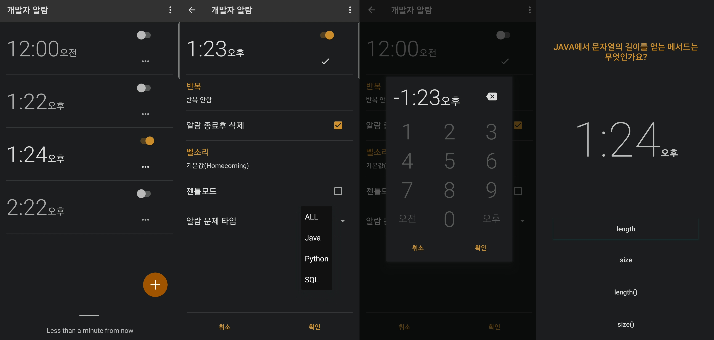

# Developer Alarm Clock
Developer Alarm Clock is an alarm clock application for Android smartphones and tablets that has evolved from the Simple Alarm Clock repository. It is designed to cater to developers by offering a wide range of coding-related questions from Java, SQL, and other domains. To turn off the alarm, users must solve the presented coding problems. With Developer Alarm Clock, waking up becomes an opportunity to exercise coding skills and start the day with a mental challenge.

# Features
* Low volume gentle alarm: The alarm starts with a low volume sound that gradually increases, ensuring a peaceful awakening during the optimal sleep phase.
* Advanced time picker: The time selection interface is inspired by the Jelly Bean style, providing a user-friendly phone-style keyboard for effortless time input.
* Volume fade-in and vibration: The alarm sound gradually fades in, accompanied by optional vibration, offering a smooth and non-disruptive wake-up experience.
* Snooze options: Users can choose to snooze the alarm for a predefined duration with a single click or set a custom snooze time using the convenient time picker.
* Dismiss with long press: To prevent accidental alarm dismissal, users can dismiss the alarm by performing a long press gesture.
* Adjustable snooze time: Long pressing the snooze button opens a time picker, allowing users to set a personalized snooze duration.

# Open source
The application's source code is derived from the Android Open Source Project (AOSP) and is available as an open-source project. We welcome feature requests and bug reports from the developer community. Please feel free to submit your suggestions by sending an email to the developers.

The repository has been forked to create the Developer Alarm Clock, which focuses on providing coding challenges and requires solving problems before turning off the alarm. The name has been changed to reflect this transformation and better suit the target audience. The original features and clean interface of the Simple Alarm Clock have been preserved, ensuring a simple, intuitive, and efficient user experience for developers.

# License
Apache 2.0

